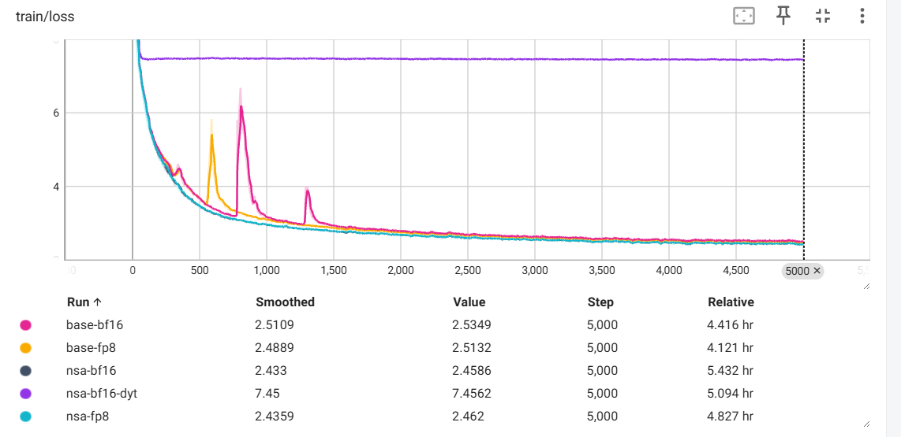
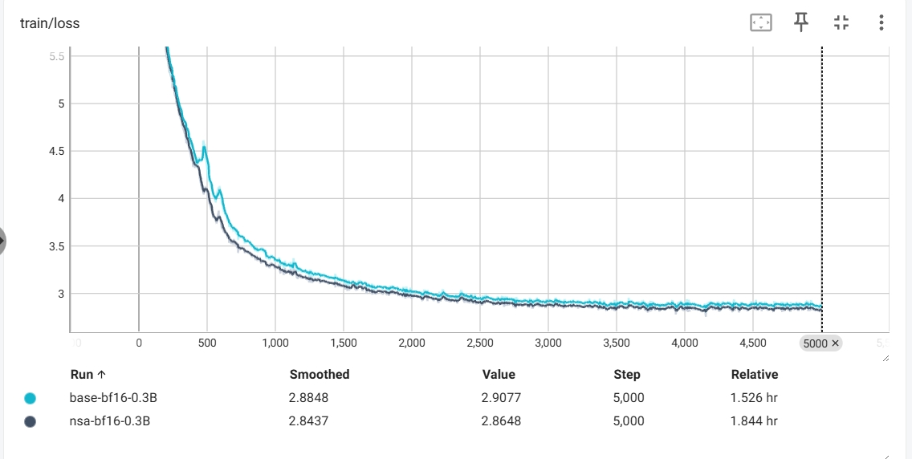
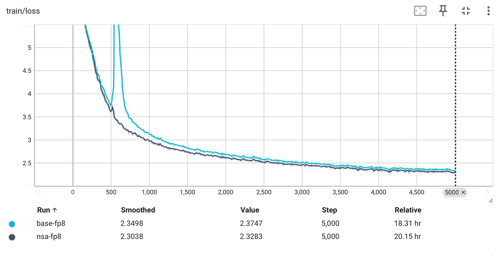
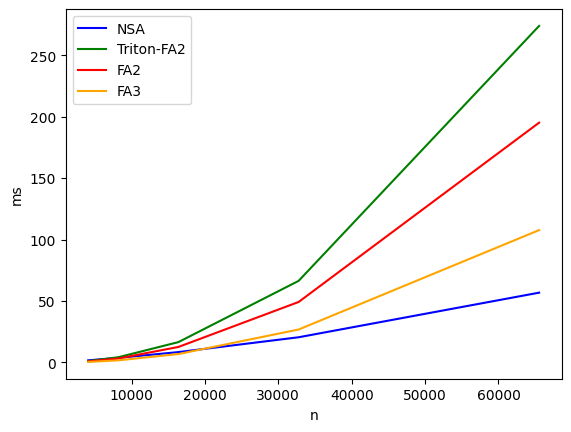
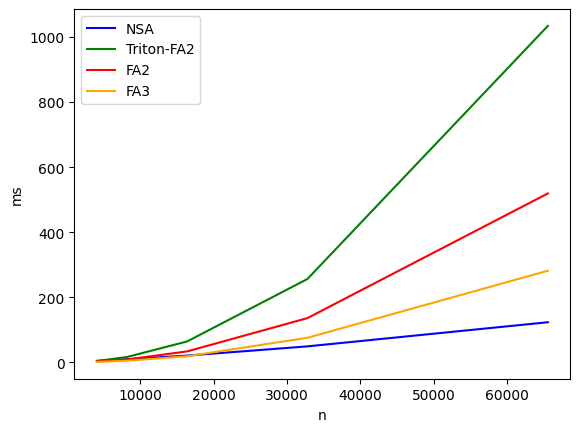

# 介绍

- 将 **NSA (Native Sparse Attention)** 应用于 **Qwen2.5** 中。真实训练和测速，欢迎大家提建议
- 论文链接：[NSA Paper](https://arxiv.org/pdf/2502.11089)
- NSA接口快速使用
  ```python
  import torch
  from nsa_attention.nsa_attn import NsaAttention

  device = 'cuda'
  dtype = torch.bfloat16
  b, n, qh, kh, qk_head_dim, v_head_dim = 1, 1024 * 64, 64, 4, 128, 128
  kernel_size = 32
  stride = 16
  select_size = 64
  window_size = 512
  top_n = 16

  q = torch.randn(b, n, qh, qk_head_dim, device=device, dtype=dtype)
  k = torch.randn(b, n, kh, qk_head_dim, device=device, dtype=dtype)
  v = torch.randn(b, n, kh, v_head_dim, device=device, dtype=dtype)
  q.requires_grad_(True)
  k.requires_grad_(True)
  v.requires_grad_(True)

  nsa = NsaAttention(qk_head_dim, v_head_dim, kernel_size, stride, select_size, top_n, window_size).to(device).to(dtype)
  y = nsa(q, k, v)
  dy = torch.randn_like(y)
  y.backward(dy)
  ```

---

# 启动命令

在 `train.sh` 中配置好其它参数后，使用以下命令进行启动：

```bash
# base-bf16
bash train.sh --deepspeed

# base-fp8
bash train.sh --deepspeed --fp8 --fp8-pattern proj

# nsa-bf16
bash train.sh --deepspeed --nsa

# nsa-fp8
bash train.sh --deepspeed --nsa --fp8 --fp8-pattern proj
```

---

# 测试结果

## 训练损失 (Training Loss)

- **1.5B**：配置文件写错了（QWQ），本来要训练 Qwen 3B，但模型层数改错了，变成了 1.5B。具体日志使用tensorboard查看log文件夹。"--dyt"开启新大陆
  
  

- **0.3B**
  
  

- **7B**
  
  


## NSA 前向传播 (NSA Forward)

- **说明**：NSA 是端到端的时间，输入 `qkv`，输出 `combine-o`，包括 `compress_attn`、`select_attn`、`window_attn` 和 `combine`。
  
  
```bash
forward:
         n        NSA  Triton-FA2         FA2         FA3
0   4096.0   1.709360    1.150744    0.835265    0.411296
1   8192.0   3.311765    4.221737    3.055912    1.616297
2  16384.0   7.280990   16.473396   11.883659    6.544441
3  32768.0  18.277786   67.683357   46.451984   26.166731
4  65536.0  51.926529  272.943909  185.468445  103.667168
```

## NSA 反向传播 (NSA Backward)

  
```bash
backward:
         n         NSA  Triton-FA2         FA2         FA3
0   4096.0    4.103184    3.923189    2.459532    1.370661
1   8192.0    8.592928   14.868421    8.864939    4.856082
2  16384.0   19.052410   58.531010   33.624817   18.598303
3  32768.0   45.934288  235.147644  132.935776   73.087234
4  65536.0  121.322205  942.912842  525.255737  291.490326
```

---

# 具体文件说明

## `nsa_attention` 文件夹

- 该文件夹中 `compress_attn` 和 `select_attn` 包含多个版本，`v1` 是我最初的版本。
- **为什么会有 `v2` 版本？**  
  我使用了大佬们开发的 NSA 仓库（[Native Sparse Attention](https://github.com/fla-org/native-sparse-attention)），发现同样代码，他们的 `select_attn` 的 `forward` 比我快了一倍。唯一区别是我的 Triton 代码里都是自己去做 `ptrs`，没有使用 `tl.make_block_ptr` 函数。`v2` 版本是所有的 `attention` 相关的 kernel 都使用 `tl.make_block_ptr` 去生成指针。具体对比可以在 `精度和性能测试.ipynb` 文件中查看：
  - `compress_attn` 的 `v1` 和 `v2` 差不多，`v1`略快一点点。
  - `select_attn` 的 `v1` 的 `forward` 比 `v2` 慢了一倍。
  - `select_v3` 是 `fwd` 和 `bwd_dq` 使用 `tl.make_block_ptr` 去制作指针，其他与 `v1` 保持不变。

## `triton_kernel` 文件夹

- 替换 `transformers` 中一些算子，效率更高效。

## `fp8` 文件夹

- 应用 **DeepSeek** 开发的 **DeepGemm** 到训练中。

## `dataset` 文件夹

- 使用 **Megatron GPT Dataset** 读取数据，可替换。  
  **注意**：`label` 已经是 `shift` 之后的了。
